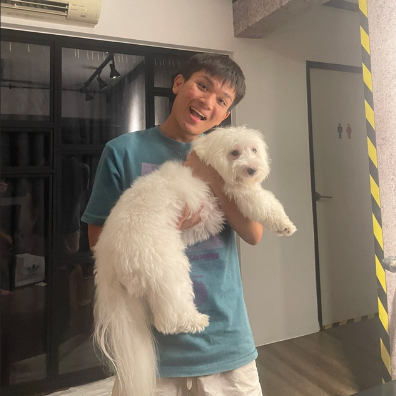
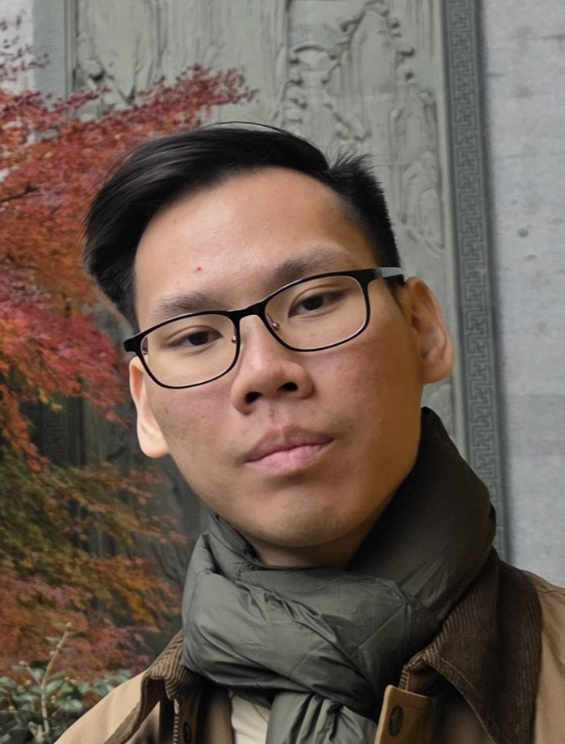
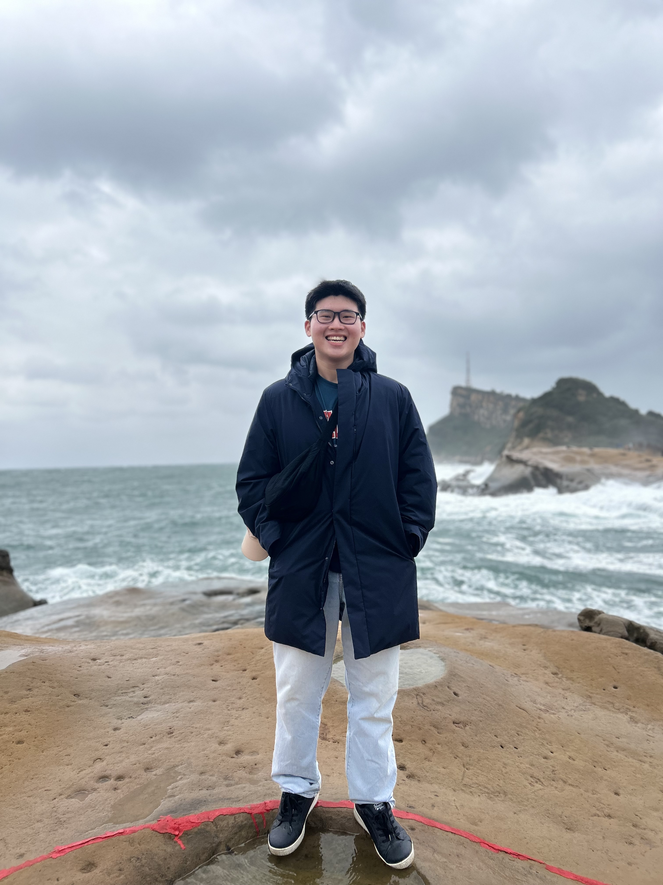
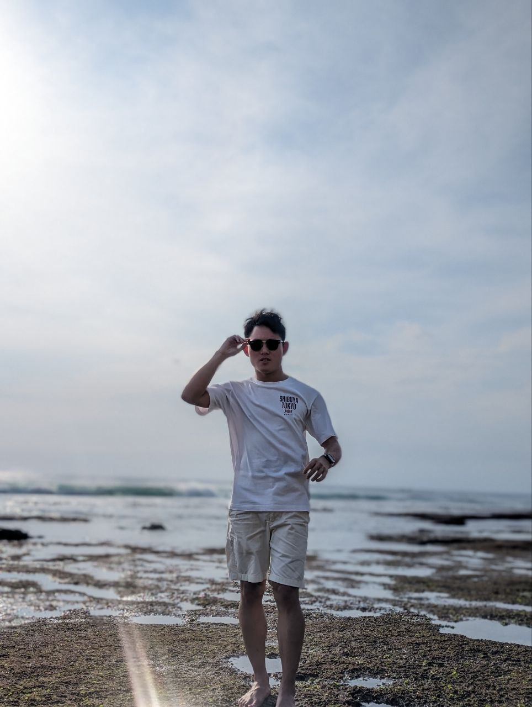

# About Us

We are a team based in the [School of Computing, National University of Singapore](http://www.comp.nus.edu.sg).

You can reach us at the email `seer[at]comp.nus.edu.sg`

## Project team

### Yik Leong

[[github](http://github.com/bolasika)]

* Role: Backend Developer
* Responsibilities: Feature development & Testing
  
### Delwyn Ho

[[github](http://github.com/nywled)]

* Role: Developer
* Responsibilities: Dev Ops + Documentation

### Marcus Chan

[[github](http://github.com/SpaceMongoose)]

* Role: Developer
* Responsibilities: Data

### Ee Jon

[[github](http://github.com/eejon)]

* Role: Developer
* Responsibilities: Dev Ops + Threading + Testing

### David

[[github](http://github.com/breezuu)]

* Role: Developer
* Responsibilities: UI + Testing
